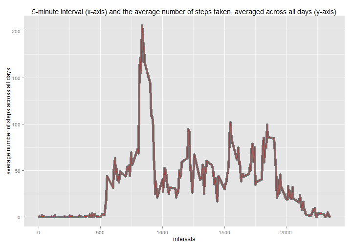

# Reproducible Research: Peer Assessment 1

We will use the ggplot2 package throughout this assignment. Additionally we have to set the locales to en (Thursday instead of Donnerstag etc. )


First set the locale to English.

```r
Sys.setlocale("LC_ALL", "English")
```

```
## [1] "LC_COLLATE=English_United States.1252;LC_CTYPE=English_United States.1252;LC_MONETARY=English_United States.1252;LC_NUMERIC=C;LC_TIME=English_United States.1252"
```


## Loading and preprocessing the data

**Step 1. Load the data**

First we have to load the data 

```r
data <- read.csv(file = "activity.csv", colClasses = c("numeric", "character", 
    "numeric"), header = TRUE, sep = ",", row.names = NULL, na.strings = "NA", 
    stringsAsFactors = TRUE)
str(data)
```

```
## 'data.frame':	17568 obs. of  3 variables:
##  $ steps   : num  NA NA NA NA NA NA NA NA NA NA ...
##  $ date    : chr  "2012-10-01" "2012-10-01" "2012-10-01" "2012-10-01" ...
##  $ interval: num  0 5 10 15 20 25 30 35 40 45 ...
```

```r
head(data)
```

```
##   steps       date interval
## 1    NA 2012-10-01        0
## 2    NA 2012-10-01        5
## 3    NA 2012-10-01       10
## 4    NA 2012-10-01       15
## 5    NA 2012-10-01       20
## 6    NA 2012-10-01       25
```


**Step 2. Process/transform the data (if necessary) into a format suitable for your analysis**

We will create a data frame with the sums of steps taken per day.

```r
dayAggregates <- aggregate(data[, c("steps")], by = list(data$date), "sum")
names(dayAggregates) <- c("day", "sumOfSteps")
head(dayAggregates)
```

```
##          day sumOfSteps
## 1 2012-10-01         NA
## 2 2012-10-02        126
## 3 2012-10-03      11352
## 4 2012-10-04      12116
## 5 2012-10-05      13294
## 6 2012-10-06      15420
```


Also we will need a 5-minute interval and the average number of steps taken, averaged across all days (we need to take care of NA values by setting na.rm=TRUE) 


```r
intervalAverages <- aggregate(data[, c("steps")], by = list(data$interval), 
    FUN = function(x) mean(x, na.rm = TRUE))
names(intervalAverages) <- c("interval", "averageNumberSteps")
head(intervalAverages)
```

```
##   interval averageNumberSteps
## 1        0            1.71698
## 2        5            0.33962
## 3       10            0.13208
## 4       15            0.15094
## 5       20            0.07547
## 6       25            2.09434
```


## What is mean total number of steps taken per day?

For this part of the assignment, you can ignore the missing values in the dataset.

**Step 1. Make a histogram of the total number of steps taken each day**
   


```r
library(ggplot2)

qplot(sumOfSteps, data = dayAggregates, xlab = "number of steps taken each day", 
    ylab = "count", main = "Histogram of the total number of steps taken each day ")
```

```
## stat_bin: binwidth defaulted to range/30. Use 'binwidth = x' to adjust this.
```

 

   
**Step 2. Calculate and report the mean and median total number of steps taken per day**
   
   Let us first compute the mean of steps taken per day (NA values ae removed before the calculation is done)

```r
meanOfStepsperDay <- mean(dayAggregates$sumOfSteps, na.rm = TRUE)
meanOfStepsperDay
```

```
## [1] 10766
```

   Then median of steps taken per day (NA values ae removed before the calculation is done)

```r
medianOfStepsperDay <- median(dayAggregates$sumOfSteps, na.rm = TRUE)
medianOfStepsperDay
```

```
## [1] 10765
```


## What is the average daily activity pattern?

   **1. Make a time series plot (i.e. type = "l") of the 5-minute interval (x-axis) and the average number of steps taken, averaged across all days (y-axis)**
  
  We will use the data frame intervalAverages with values "interval" and "averageNumberSteps" that contains the computed data.
  

```r
library(ggplot2)

g <- ggplot(intervalAverages, aes(x = interval, y = averageNumberSteps)) + geom_line()
g <- g + labs(title = "5-minute interval (x-axis) and the average number of steps taken, averaged across all days (y-axis)")
g <- g + labs(x = "intervals")
g <- g + labs(y = "average number of steps across all days")
print(g)
```

 

   
   **2. Which 5-minute interval, on average across all the days in the dataset, contains the maximum number of steps?**
   
The code below returns the row(interval) which has the average number of Steps equal to the maximum found in the data set.


```r
subset(intervalAverages, intervalAverages$averageNumberSteps == max(intervalAverages$averageNumberStep, 
    na.rm = TRUE))
```

```
##     interval averageNumberSteps
## 104      835              206.2
```


## Imputing missing values

Note that there are a number of days/intervals where there are missing values (coded as NA). The presence of missing days may introduce bias into some calculations or summaries of the data.

**1. Calculate and report the total number of missing values in the dataset (i.e. the total number of rows with NAs)**

NA are only in the column steps (the other columns were checked but are not shown here). The number of NA is:

```r
length(which(is.na(data$steps)))
```

```
## [1] 2304
```


**2. Devise a strategy for filling in all of the missing values in the dataset. The strategy does not need to be sophisticated. For example, you could use the mean/median for that day, or the mean for that 5-minute interval, etc.**

We will fill the missing steps values using the mean for that 5-minute interval. We will use the round function on the means (the values were previously computed in the variable intervalAverages) to round the missing values to the nearest integer (hence it doesn't make sense to have i.e. 5.4 steps for a day).

The variable intervalAveragesMulti is just a multiplication of intervalAverages.
Hence we have 61 days and 288 interval per day, it's lenght is 17568 (and stores the correct mean for each interval).
We need to be able to use it in the ifelse function below.

**3. Create a new dataset that is equal to the original dataset but with the missing data filled in.**


```r
length(data$steps)
```

```
## [1] 17568
```

```r

intervalAveragesMulti <- rep(intervalAverages[, "averageNumberSteps"], length(unique(data$date)))

length(intervalAveragesMulti)
```

```
## [1] 17568
```

```r

dataWithoutNA <- data
dataWithoutNA$steps <- ifelse(is.na(data[, "steps"]), round(intervalAveragesMulti), 
    dataWithoutNA[, "steps"])
```


An example that shows that if a value was set it is used.

```r
data[4134, ]
```

```
##      steps       date interval
## 4134    72 2012-10-15      825
```

```r
intervalAveragesMulti[4134]
```

```
## [1] 155.4
```

```r
dataWithoutNA[4134, ]
```

```
##      steps       date interval
## 4134    72 2012-10-15      825
```


An example that shows that if a value was not set the computed rounded mean is used.

```r
data[1, ]
```

```
##   steps       date interval
## 1    NA 2012-10-01        0
```

```r
intervalAveragesMulti[1]
```

```
## [1] 1.717
```

```r
round(intervalAveragesMulti[1])
```

```
## [1] 2
```

```r
dataWithoutNA[1, ]
```

```
##   steps       date interval
## 1     2 2012-10-01        0
```


Verify that there are no NAs.

```r
length(which(is.na(dataWithoutNA$steps)))
```

```
## [1] 0
```


**4. Make a histogram of the total number of steps taken each day and Calculate and report the mean and median total number of steps taken per day. Do these values differ from the estimates from the first part of the assignment? What is the impact of imputing missing data on the estimates of the total daily number of steps?**

We will create a data frame with the sums of steps taken per day (with NA values replaced be rounded means per interval across all days)

```r
dayAggregateseWithoutNA <- aggregate(dataWithoutNA[, c("steps")], by = list(data$date), 
    "sum")
names(dayAggregateseWithoutNA) <- c("day", "sumOfSteps")
head(dayAggregateseWithoutNA)
```

```
##          day sumOfSteps
## 1 2012-10-01      10762
## 2 2012-10-02        126
## 3 2012-10-03      11352
## 4 2012-10-04      12116
## 5 2012-10-05      13294
## 6 2012-10-06      15420
```


Now that we have the data frame, let's create the histogram:

```r
library(ggplot2)

qplot(sumOfSteps, data = dayAggregateseWithoutNA, xlab = "number of steps taken each day (NA replaced with rounded means)", 
    ylab = "count", main = "Histogram of the total number of steps taken each day ")
```

```
## stat_bin: binwidth defaulted to range/30. Use 'binwidth = x' to adjust this.
```

 


   Let us now compute the mean of steps taken per day (NA values are repalced with rounded means per interval across all days)

```r
meanOfStepsperDayWithoutNA <- mean(dayAggregateseWithoutNA$sumOfSteps)
meanOfStepsperDayWithoutNA
```

```
## [1] 10766
```

Under the same conditions  we will calculate the median

```r
medianOfStepsperDayWithoutNA <- median(dayAggregateseWithoutNA$sumOfSteps)
medianOfStepsperDayWithoutNA
```

```
## [1] 10762
```


The impact of repalcing NA with the rounded means is very small.
The mean changed from 

```r
meanOfStepsperDay
```

```
## [1] 10766
```

to 

```r
meanOfStepsperDayWithoutNA
```

```
## [1] 10766
```


Similarely the median changed from 

```r
medianOfStepsperDay
```

```
## [1] 10765
```

to 

```r
medianOfStepsperDayWithoutNA
```

```
## [1] 10762
```

Finally lets us take a look how the histograms differ. We will plot them together.

First we will nedd a 5-minute interval and the average number of steps taken, aggregated across all days, with previously NA values replaced by mean rounded t nearest integer. 


```r
intervalAveragesWithoutNA <- aggregate(dataWithoutNA[, c("steps")], by = list(dataWithoutNA$interval), 
    FUN = mean)
names(intervalAveragesWithoutNA) <- c("interval", "averageNumberSteps")
head(intervalAveragesWithoutNA)
```

```
##   interval averageNumberSteps
## 1        0            1.75410
## 2        5            0.29508
## 3       10            0.11475
## 4       15            0.13115
## 5       20            0.06557
## 6       25            2.08197
```


Now we are ready to plot the 2 histograms. We will slightly modify the first plot of histogram (will be thicker, to be good visible in the background) and then apply the histogram for our new data set with NA replaced (red) on top of the first

```r
library(ggplot2)

g <- ggplot(intervalAverages, aes(x = interval, y = averageNumberSteps)) + geom_line(alpha = 0.5, 
    size = 2)
g <- g + labs(title = "5-minute interval (x-axis) and the average number of steps taken, averaged across all days (y-axis)")
g <- g + labs(x = "intervals")
g <- g + labs(y = "average number of steps across all days")
g <- g + geom_line(data = intervalAveragesWithoutNA, colour = "red", alpha = 0.5)
print(g)
```

 


## Are there differences in activity patterns between weekdays and weekends?

For this part the weekdays() function may be of some help here. Use the dataset with the filled-in missing values for this part.

**1. Create a new factor variable in the dataset with two levels -- "weekday" and "weekend" indicating whether a given date is a weekday or weekend day.**

The code below first assigns each row to be of type "weekend" or "weekday" and in step number 2 creates a factor (dayType).

```r
dataWithoutNA$dayType <- ifelse(weekdays(strptime(dataWithoutNA$date, "%Y-%m-%d")) %in% 
    c("Saturday", "Sunday"), "weekend", "weekday")

dataWithoutNA <- transform(dataWithoutNA, dayType = factor(dayType))
head(dataWithoutNA)
```

```
##   steps       date interval dayType
## 1     2 2012-10-01        0 weekday
## 2     0 2012-10-01        5 weekday
## 3     0 2012-10-01       10 weekday
## 4     0 2012-10-01       15 weekday
## 5     0 2012-10-01       20 weekday
## 6     2 2012-10-01       25 weekday
```


**2. Make a panel plot containing a time series plot (i.e. type = "l") of the 5-minute interval (x-axis) and the average number of steps taken, averaged across all weekday days or weekend days (y-axis).**

First we have to calculate the data. We aggregate the data by interval and dayType (weekend or weekday) and calculate the mean for each group.

```r
avgStepsIntervalSteps <- aggregate(dataWithoutNA[, c("steps")], by = list(dataWithoutNA$interval, 
    dataWithoutNA$dayType), FUN = mean)
names(avgStepsIntervalSteps) <- c("interval", "dayType", "averageNumberSteps")
head(avgStepsIntervalSteps)
```

```
##   interval dayType averageNumberSteps
## 1        0 weekday            2.28889
## 2        5 weekday            0.40000
## 3       10 weekday            0.15556
## 4       15 weekday            0.17778
## 5       20 weekday            0.08889
## 6       25 weekday            1.57778
```


Now we are ready to construct the final plot:

```r
finalPlot <- ggplot(avgStepsIntervalSteps, aes(x = interval, y = averageNumberSteps)) + 
    geom_line(alpha = 1, size = 1, color = "blue")
finalPlot <- finalPlot + labs(x = "intervals")
finalPlot <- finalPlot + labs(y = "Number of steps")
finalPlot <- finalPlot + facet_wrap(~dayType, nrow = 2, ncol = 1)
finalPlot <- finalPlot + theme_bw()
finalPlot <- finalPlot + theme(panel.grid.major = element_blank())
finalPlot <- finalPlot + theme(strip.background = element_rect(fill = "lightpink"))
print(finalPlot)
```

 


